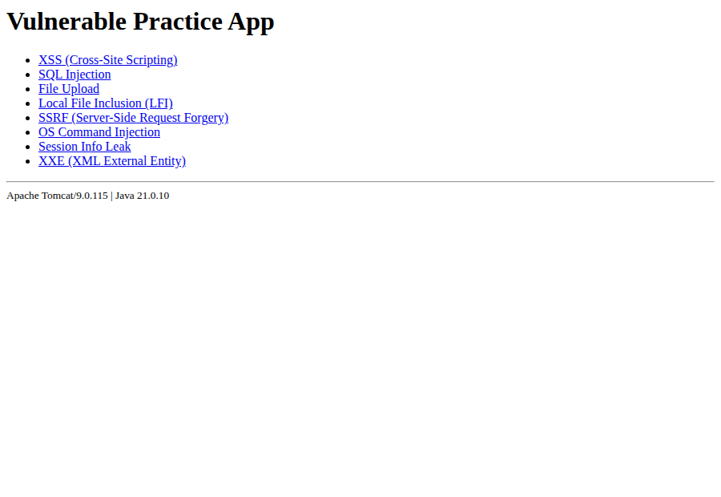
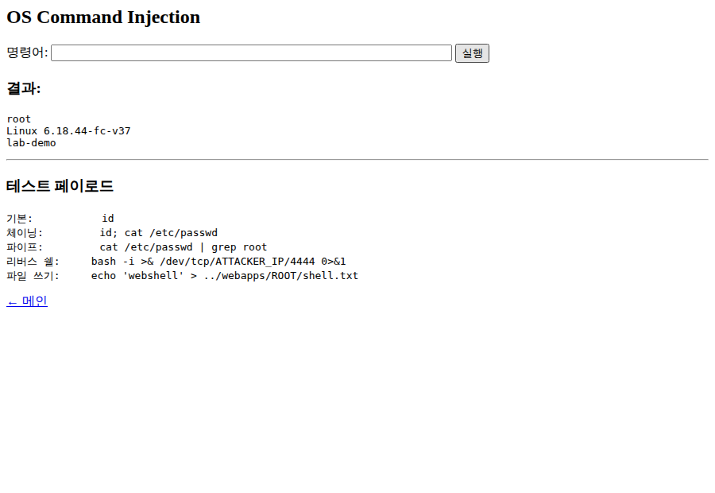
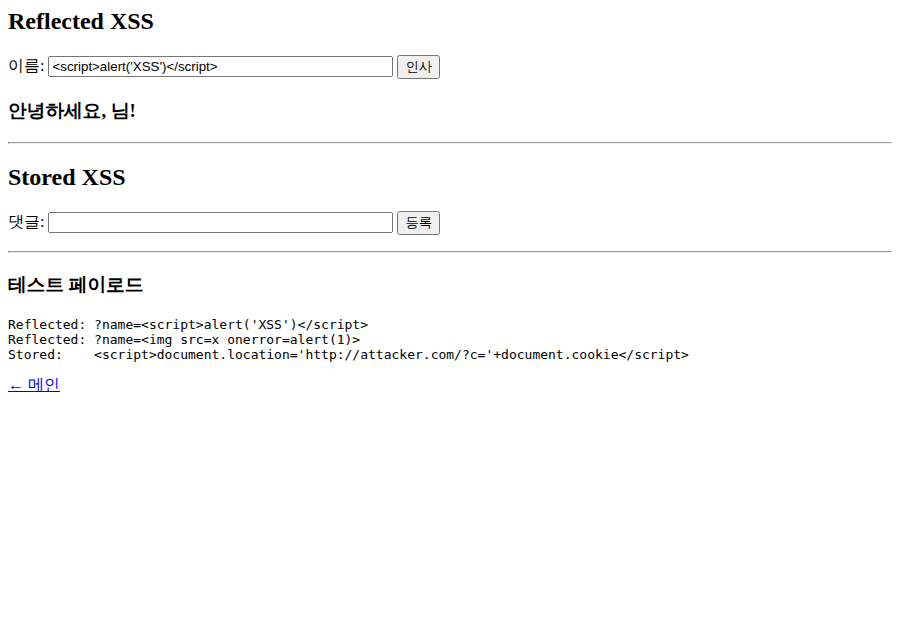
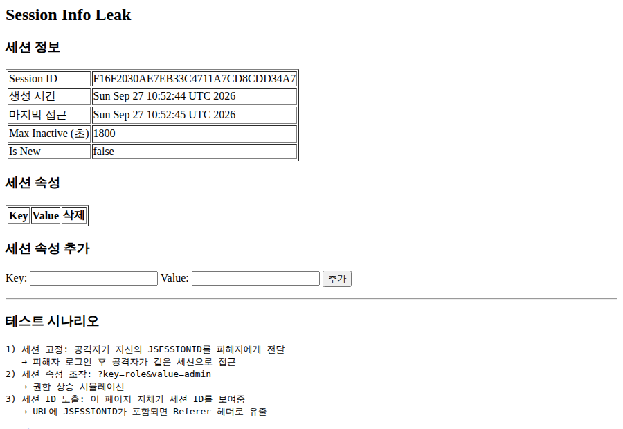
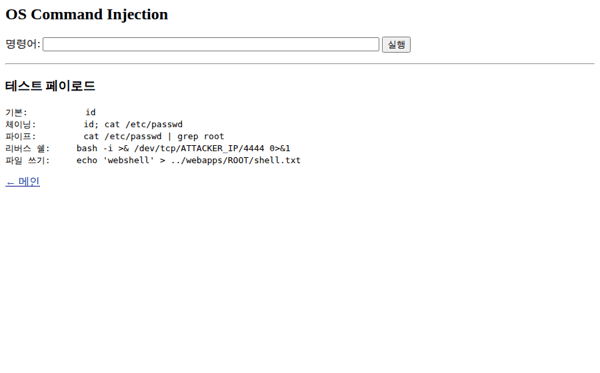

# Apache httpd + Tomcat Vulnerability Practice Lab

A local practice environment for reproducing and inspecting security misconfigurations in Apache httpd and Apache Tomcat, plus common web application vulnerabilities.

[한국어](README.md) | **English**

> ⚠️ **Warning**: This repository is an intentionally vulnerable environment for learning only. Run it only on an isolated, local-only machine that is separated from any external network. Never expose it to the internet or a shared network.

## Screenshots

| Vuln-app menu | OS Command Injection |
|---|---|
|  |  |

| Reflected XSS | Session info leak |
|---|---|
|  |  |

Command injection flow:



## Features

- **Three configuration profiles**: `default` (hardened), `vulnerable` (exposed), and `answer` (exposed plus inline fix notes). Switch between them with a single command.
- **Apache httpd misconfigurations**: directory listing, server banner disclosure, TRACE method, filesystem root access, `server-status`/`server-info` exposure, CGI command injection, config/log directory Alias exposure, `.htaccess` access, `AllowOverride All`, `FollowSymLinks`, `AllowEncodedSlashes`.
- **Tomcat misconfigurations**: weak Manager password, missing brute-force protection (LockOutRealm removed), unrestricted AJP (Apache JServ Protocol) exposure (GhostCat, CVE-2020-1938), exposed shutdown port, version disclosure, `autoDeploy` enabled.
- **Vulnerable web application (vuln-app)**: XSS, SQL Injection, file upload, LFI (Local File Inclusion), SSRF (Server-Side Request Forgery), OS command injection, session info leak, and XXE (XML External Entity), implemented as JSP pages.
- **mod_jk integration**: Apache forwards requests to Tomcat through an AJP worker.

For how to reproduce each issue, why it is dangerous, and how to fix it, see [docs/PRACTICE_LAB.md](docs/PRACTICE_LAB.md).

## Usage

### Prerequisites

This repository contains only configuration files and the practice application. You install the Apache httpd and Tomcat binaries yourself.

- Apache httpd 2.4.x (with mod_jk) — e.g. `2.4.66`
- Apache Tomcat 9.0.x — e.g. `9.0.115`
- Java (JDK) 8 or later to run Tomcat 9 (verified with JDK 21)

### Install

1. Install httpd and Tomcat wherever you like.
2. Copy the configs and app from this repository into each install location.

   ```bash
   git clone https://github.com/patissierMongs/httpd-tomcat-vuln-lab.git
   cd httpd-tomcat-vuln-lab

   # httpd profiles, CGI, and htdocs
   cp -r conf/profiles       "$HTTPD_HOME/conf/profiles"
   cp -r cgi-bin/*           "$HTTPD_HOME/cgi-bin/"
   cp -r htdocs/*            "$HTTPD_HOME/htdocs/"
   cp conf/extra/httpd-jk.conf "$HTTPD_HOME/conf/extra/"
   cp conf/workers.properties  "$HTTPD_HOME/conf/"

   # Tomcat profiles and the vulnerable app
   cp -r tomcat-profiles     "$TOMCAT_HOME/conf/profiles"
   cp -r vuln-app            "$TOMCAT_HOME/webapps/vuln"
   ```

   `$HTTPD_HOME` and `$TOMCAT_HOME` are the paths where you installed httpd and Tomcat.

### Run

The profile switch script copies the configs and restarts the services for you. Set the install paths through environment variables.

```bash
export HTTPD_HOME=/opt/httpd-2.4.66
export TOMCAT_HOME=/opt/tomcat

# Start with the hardened (default) settings
./switch-profile.sh default

# Switch to the vulnerable settings
./switch-profile.sh vulnerable

# Vulnerable settings with inline fix notes
./switch-profile.sh answer
```

After switching, open:

- Apache httpd: `http://localhost:8881`
- Tomcat: `http://localhost:8080`
- Vulnerable web app: `http://localhost:8080/vuln/` (or via mod_jk at `http://localhost:8881/vuln/`)

> `switch-profile.sh` fills the `Define SRVROOT` value at the top of the copied `httpd.conf` from `HTTPD_HOME`. If you start httpd directly, set `Define SRVROOT` to your actual install path.

### Basic examples

```bash
# Directory listing
curl http://localhost:8881/secret/

# Server banner header
curl -I http://localhost:8881/

# CGI command injection
curl "http://localhost:8881/cgi-bin/cmd.sh?cmd=id"

# Vuln-app - reflected XSS
# Browser: http://localhost:8080/vuln/xss.jsp?name=<script>alert(1)</script>
```

## Tech stack

| Area | Technology | Version |
|------|------------|---------|
| Web server | Apache httpd | 2.4.x (e.g. 2.4.66) |
| Servlet container | Apache Tomcat | 9.0.x (e.g. 9.0.115) |
| Connector module | mod_jk (AJP13) | worker1 |
| Runtime | Java (JDK) | 8+ (verified with 21) |
| Application | JSP / Servlet | 4.0 (`web.xml`) |
| Database | SQLite (JDBC) | driver required separately (see below) |
| Scripting | Bash | `switch-profile.sh`, CGI |

Ports: Apache httpd `8881`, Tomcat HTTP `8080`, AJP `8009`, shutdown `8005`.

> The SQL Injection page (`sqli.jsp`) needs a SQLite JDBC driver JAR in `vuln-app/WEB-INF/lib/` to work. That directory is excluded by `.gitignore` and is not part of the repository, so add the driver yourself.

## Docs

- [docs/PRACTICE_LAB.md](docs/PRACTICE_LAB.md) — detailed reproduction, cause, and fix for all 26 issues
- [docs/PROGRESS.en.md](docs/PROGRESS.en.md) — project goal, implementation status, and work history
